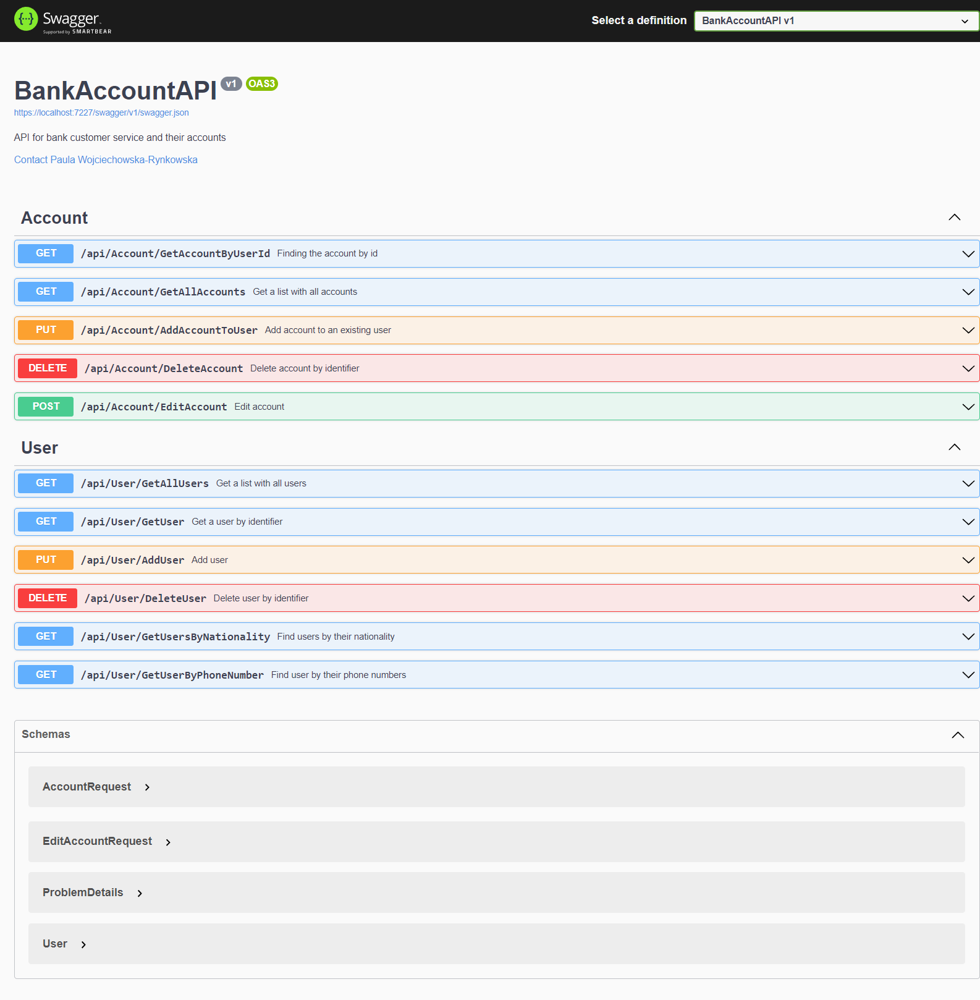
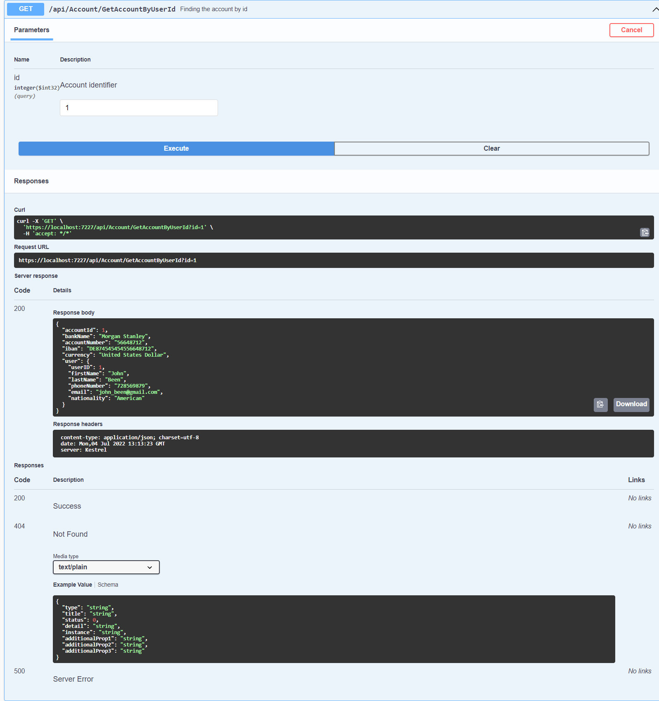
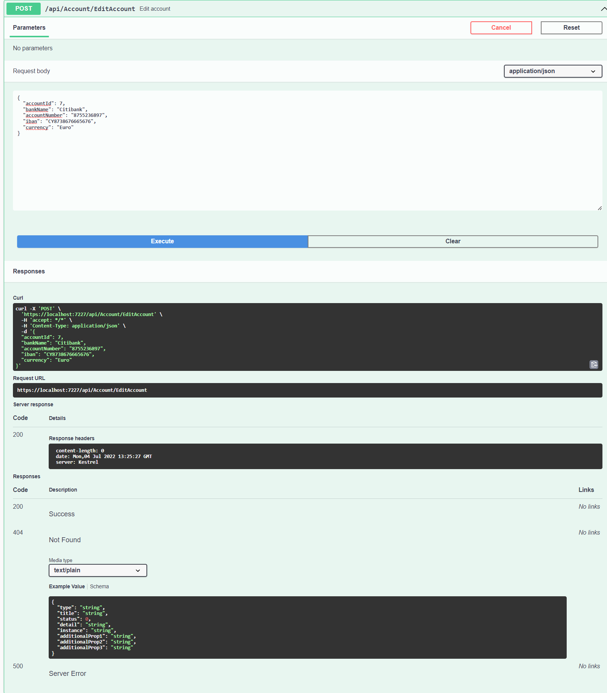
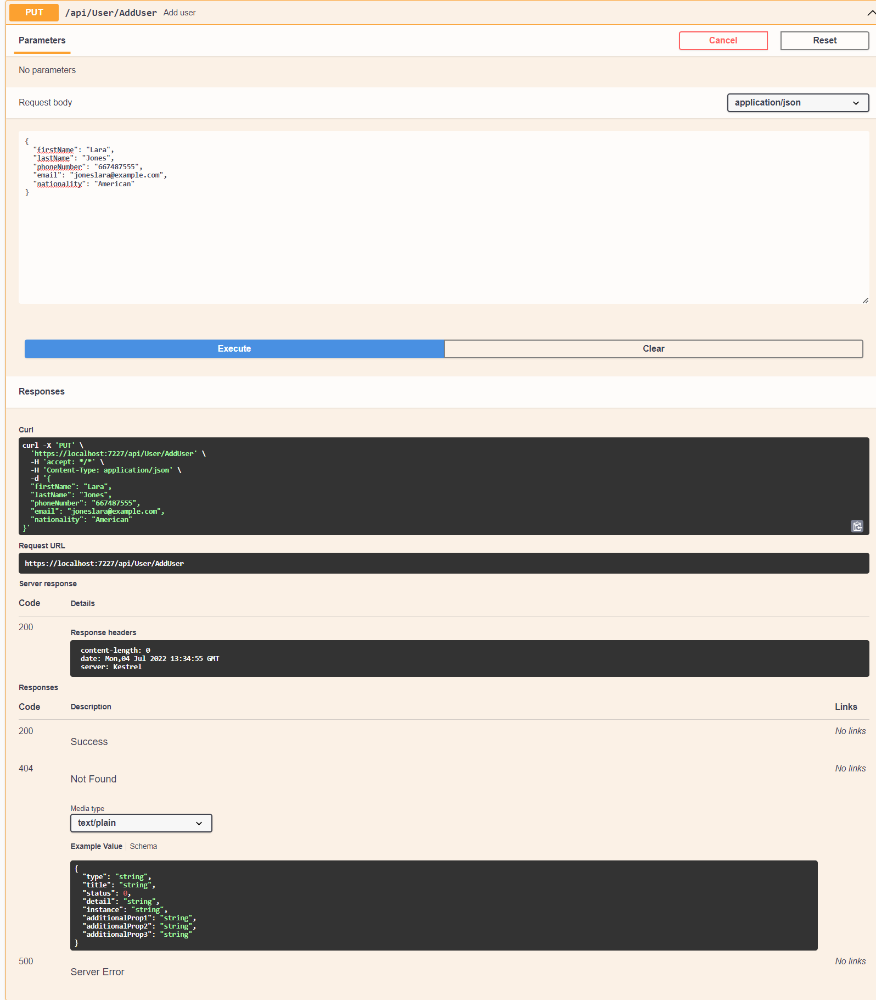
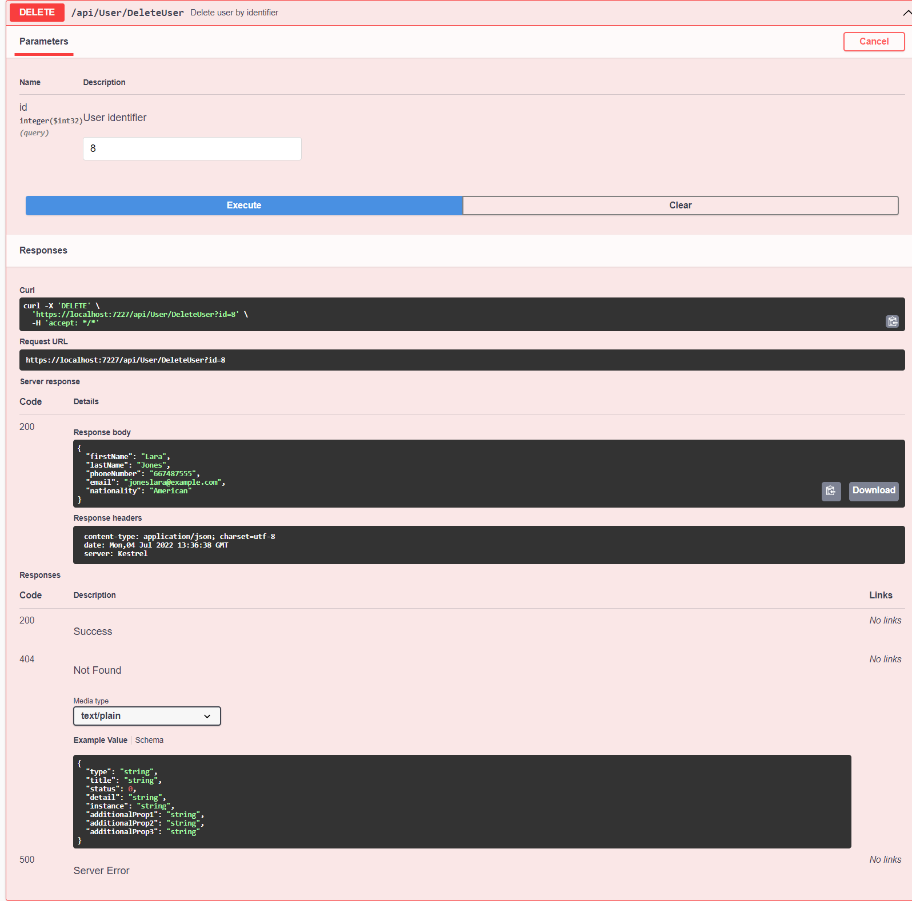

# BankAccountAPI

Simple API  for manage users and their accounts. 

## Description

The API allows reading, adding, deleting and editing users and their accounts in a connected SQL database.
Plus methods to search for users by specific properties. 
Full documentation in Swagger, includes descriptions of methods, parameters and possible results.

## Build with
- .NET 6.0
- EF 6.0
